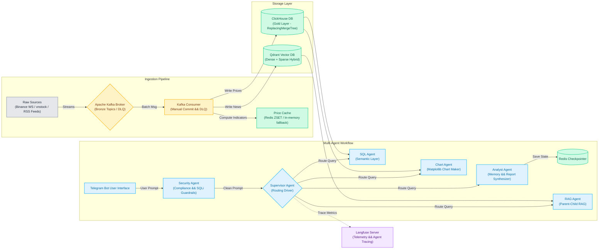
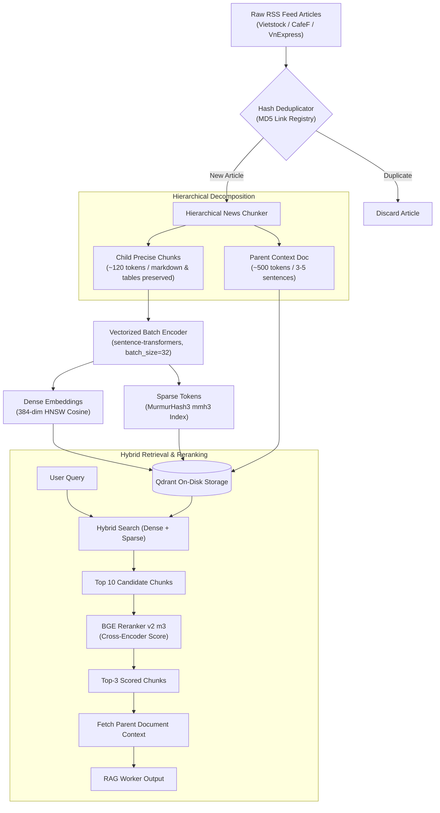

# FinAgent: Financial Data Multi-Agent & Stream Pipeline

## Project Overview

An enterprise-grade **Real-time Financial Ingestion Pipeline & Multi-Agent System**. This project ingests live cryptocurrency trades, Vietnamese stock quotes, and financial news feeds, processes them through a **Kafka** streaming broker, enriches market data with technical indicators using a **Redis/In-memory hybrid cache**, stores structured data in **ClickHouse** and semantic data in a **Qdrant** vector database (with dense/sparse hybrid indexing), and exposes an interactive **LangGraph-based Multi-Agent intelligence network** accessible via a **Telegram Bot** interface with tracing monitored by **Langfuse**.

**Business Goal:** Deliver real-time quantitative indicator tracking and semantic RAG macro-insights directly to traders/analysts through a natural language interface, coordinating agents to query relational databases, perform hybrid vector search, generate technical charts, and output synthesized financial assessments.

---

## Architecture & Tech Stack



* **Streaming Orchestration:** 
* **Real-time Cache:** 
* **Columnar DB:** 
* **Vector DB:** 
* **Agent Framework:**  + 
* **Deployment & Containers:** 
* **Language/Libraries:**  + 

---

## Multi-Agent Routing & Intent Decision Matrix

The coordination network uses a hybrid routing strategy combining a **sub-3ms Semantic Vector Router** (`SemanticVectorRouter`) for fast single/multi-intent identification and an **LLM Reasoning Fallback** for ambiguous queries:

| Detected Intent | Sample User Query | Routing Mechanism | Target Worker Node | Underlying Tool / Data Source |
| :--- | :--- | :--- | :--- | :--- |
| `INTENT_SQL` | *"What is the latest price and RSI for HPG?"* | Fast-Path Vector Embedding Similarity (`score > 0.82`) | **SQL Worker** | ClickHouse Semantic Layer (`get_ticker_price`, `get_indicators`) |
| `INTENT_CHART` | *"Draw a technical chart with MACD and SMA for SSI"* | Fast-Path Vector Embedding Similarity (`score > 0.80`) | **Chart Worker** | Headless Matplotlib Renderer (`generate_technical_chart`) |
| `INTENT_RAG` | *"Summarize recent news regarding State Bank of Vietnam interest rates"* | Fast-Path Vector Embedding Similarity (`score > 0.78`) | **RAG Worker** | Qdrant Dense+Sparse Hybrid Index + BGE Reranker |
| `INTENT_COMPLEX` | *"Analyze FPT stock price, show chart, and evaluate recent AI cloud expansion news"* | Clause Splitting + Multi-Threshold Fast-Path | **Dynamic Fan-out** (SQL + Chart + RAG concurrently $\rightarrow$ Analyst) | Parallel execution across ClickHouse, Matplotlib, and Qdrant |
| `AMBIGUOUS` | *"What should I do with my portfolio today?"* | LLM Reasoning Fallback (`qwen2.5-coder:1.5b`) | **Analyst Worker** | Direct dialogue synthesis with Redis chat checkpointer |

---

## 3-Layer RAG & Ingestion Data Contract

The unstructured knowledge pipeline converts financial RSS news feeds into queryable semantic representations:



---

## Dynamic Multi-Panel Technical Charting Modes

The `ChartAgent` module renders publication-grade financial charts via thread-safe, object-oriented Matplotlib:

| Chart Mode | Panel Layout | Visual Indicators Included | Primary Use Case |
| :--- | :---: | :--- | :--- |
| `comprehensive` | 2-Panel Vertical | Top: Price Candles + SMA-5/20 + Bollinger Bands<br>Bottom: MACD Histogram & Signal Line | Holistic market momentum and trend analysis |
| `price_sma` | 1-Panel Single | Close Prices + 5-day & 20-day Simple Moving Averages | Quick trend direction and Golden/Death cross inspection |
| `rsi` | 2-Panel Vertical | Top: Price line<br>Bottom: 14-period RSI with 70 Overbought & 30 Oversold thresholds | Mean reversion and overextended price detection |
| `macd` | 2-Panel Vertical | Top: Price line<br>Bottom: MACD Line, Signal Line, and Positive/Negative Momentum Bars | Momentum convergence and divergence confirmation |
| `volume` | 2-Panel Vertical | Top: Price line<br>Bottom: Color-coded trading volume bars | Liquidity confirmation and breakout validation |

---

## Pipeline Workflow

### 1. Real-time Ingestion (Producers)
* **Binance WS Stream:** Connects directly to Binance WebSockets, listening to live ETHUSDT and BTCUSDT trades. Formats records to match the system's ingestion data contract and publishes them to the `finagent_market` topic.
* **vnstock Polling Stream:** Polls price boards for high-liquidity Vietnamese stock tickers (SSI, VND, HPG, FPT, etc.) using vnstock. Iterates and publishes to the market topic.
* **RSS Feeds Stream:** Parses economic feeds (Cafef, Vietstock, VnExpress) every 15 seconds. Uses a local hash registry to filter out duplicate news links and publishes new stories to the `finagent_news` topic.

### 2. Stream Ingestion & Caching (Kafka Consumer)
* **At-Least-Once Delivery:** Auto-commits are disabled (`enable_auto_commit=False`). Offsets are manually committed *only* after database inserts succeed.
* **Dead Letter Queue (DLQ):** Failed schemas, parsing failures, and contract mismatches are caught, packed with failure diagnostics, and routed to the corresponding DLQ topics (`finagent_market_dlq`, `finagent_news_dlq`).
* **Sliding Window Caching:** Utilizes `PriceCacheManager`. Uses **Redis Sorted Sets (ZSET)** indexed by timestamp scores to maintain a sliding window of the last 30 prices per symbol. If Redis is unavailable, it falls back to an **in-memory process dictionary** (safely sorting and deduplicating). ClickHouse is queried *only once* on cache miss (lazy loading) to warm up the cache, eliminating DB loop queries.
* **Indicator Calculation:** Recalculates technical metrics (SMA-5, SMA-20, RSI, MACD) on the 30-item sliding window, and bulk-inserts the newly calculated indicator rows into ClickHouse.

### 3. Semantic Layer Ingestion (Vector Database)
* **Hierarchical Chunking:** Processes ingested news articles into child chunks for precision embeddings, and preserves the wider parent document context to avoid context fragmentation.
* **Batch Vector Encoding & Hybrid Indexing:** Encodes document chunks in vectorized batches (`batch_size=32`) via `sentence-transformers`, generating dense embeddings alongside sparse vectors built via MurmurHash3 (mmh3) with collision weight aggregation. Stores both dense and sparse indices directly on disk to optimize RAM usage.

### 4. LangGraph Multi-Agent Orchestration
* **Security Agent:** Intercepts incoming Telegram inputs to guard against SQL injections, prompt manipulation, or jailbreaks using fast rule-based regex and `llama-guard3:1b`.
* **Supervisor Agent & Fast Semantic Router:** Evaluates intent via a sub-3ms `SemanticVectorRouter` with Multi-Threshold matching and Clause Splitting. Falls back to structured LLM reasoning (`qwen2.5-coder:1.5b`) on ambiguous input.
* **Dynamic Conditional Fan-out:** Branches execution exclusively to relevant workers (SQL Agent, RAG Agent, or direct to Analyst), eliminating unnecessary database queries.
* **SQL Agent:** Extracts parameters (action, ticker, limit) from user questions to query prices and technical indicators via ClickHouse Semantic Layer tools.
* **RAG Agent:** Executes hybrid dense/sparse searches against Qdrant, reranks text candidates using a cross-encoder model (`bge-reranker-v2-m3`), and fetches the expanded parent document context.
* **Chart Agent:** Dynamically generates multi-panel technical analysis charts (`comprehensive`, `price_sma`, `rsi`, `macd`, `volume`) using object-oriented, thread-safe headless Matplotlib.
* **Analyst Agent & In-Flight Context Trimming:** Synthesizes reports combining ClickHouse metrics and Qdrant macro context. Applies `trim_messages` to constrain chat history within the 800-token budget while preserving the full conversation snapshot in RedisSaver. Supports runtime switching between Local Ollama (`qwen2.5:1.5b-instruct`) and Cloud AI (OpenAI, Gemini, DeepSeek, Groq).

---

## Key Engineering Highlights

* **Multi-Provider LLM Switcher:** Users can toggle between Local Ollama and Cloud AI providers dynamically via Telegram UI buttons (`/model`) or environment settings.
* **3-Layer RAG Quality Gate & Chunking Benchmark:** Automated evaluation testing IR metrics (Hit@1, Hit@2, MRR), fact recall, and table preservation integrity in continuous integration.
* **Dynamic Multi-Panel Technical Charting:** Supports 5 distinct visualization modes (Moving Average Trends, RSI Oscillators with Overbought/Oversold thresholds, MACD Momentum Histograms, Volume analysis, and Comprehensive 2-panel Views).
* **High-Throughput Batch Vectorization:** Replaces per-item encoding with batched tensor calculations, achieving 5x–10x faster vector database ingestion.
* **Zero-Leak Stream Ingestion:** Protects continuous 24/7 RSS ingestion using bounded sliding deques to prevent memory leaks.
* **Resilient Offset Commit Policy:** Commits offsets manually *after* data ingestion succeeds, assuring zero data loss (At-Least-Once).
* **Robust DLQ Design:** Isolates malformed events into dedicated DLQ topics to prevent ingestion line blocks.
* **ClickHouse Query Offloading:** Integrates a write-through hybrid cache (Redis ZSET/In-memory fallback) to eliminate database queries inside the streaming loop.
* **Parent-Child Vector Retrieval:** Indexes precise child chunks but returns wide parent context sentences to feed the LLM accurate thematic text.
* **Semantic Query Layer:** Eliminates SQL dialect syntax issues and injection risks by utilizing a parameter-driven Python layer instead of direct LLM SQL generation.

---

## Project Structure

```
financial-data-agent-system/
│
├── src/
│   ├── agent/                         # Multi-Agent Coordination Network
│   │   ├── nodes/
│   │   │   ├── analyst.py             # Coordinator: synthesizes reports, manages session states
│   │   │   ├── chart_worker.py        # Chart Agent: generates technical charts and saves to disk
│   │   │   ├── driver.py              # Supervisor Agent: routes to specialist workers (Fast-Path + LLM Fallback)
│   │   │   ├── rag_worker.py          # RAG Agent: performs sparse/dense hybrid searches
│   │   │   ├── security.py            # Guardrail Agent: validates prompt compliance
│   │   │   └── sql_worker.py          # SQL Agent: queries prices and indicators via Semantic Layer
│   │   ├── callbacks.py               # Langfuse tracing integrations
│   │   ├── graph.py                   # LangGraph assembly (state, dynamic fan-out, checkpointer)
│   │   ├── prompts.py                 # Multi-Intent and agent system prompts
│   │   ├── router.py                  # Sub-3ms Semantic Vector Router with Multi-Threshold & Clause Splitting
│   │   └── state.py                   # AgentState schema definition
│   │
│   ├── utils/
│   │   ├── __init__.py                # Utilities package initialization
│   │   ├── chunking.py                # Hierarchical news chunker (preserves markdown/tables)
│   │   └── logger.py                  # Standardized logging wrapper
│   ├── config.py                      # Centralized environment loader & configurations
│   ├── consumer.py                    # Kafka Consumer with Manual Commits, DLQ & PriceCacheManager
│   ├── database.py                    # ClickHouse schema definition (ReplacingMergeTree) and ingest engine
│   ├── producer.py                    # Binance WS, vnstock polling, RSS financial feeds producer
│   ├── telegram_bot.py                # Telegram Bot handler running LangGraph workflows async
│   ├── tools.py                       # SQL execution, hybrid vector retrieval, indicator computing
│   └── vector_db.py                   # Qdrant hybrid (dense + sparse index HNSW) schema & ingest
│
├── tests/                             # Full Unit & Evaluation Test Suite
│   ├── evaluate.py                    # Unified 3-Layer RAG Quality Gate & Chunking Benchmark Suite
│   ├── seed_data.py                   # Test dataset initialization fixtures
│   ├── test_chunking.py               # Markdown table and hierarchical chunking tests
│   ├── test_consumer.py               # Ingestion stream, DLQ, and cache manager tests
│   ├── test_database.py               # ClickHouse query and schema tests
│   ├── test_prompt_integrity.py       # Prompt contracts and multi-agent node integrity tests
│   ├── test_router.py                 # Semantic Vector Router and Context Trimming tests
│   ├── test_security_guard.py         # Security injection guardrails and route plan tests
│   ├── test_tools.py                  # Semantic layer tools and chart rendering tests
│   └── test_vector_db.py              # Qdrant hybrid vector search tests
│
├── docker-compose.yml                 # Infrastructure stack (Kafka, Postgres, Redis, Qdrant, Langfuse)
├── requirements.txt                   # Project package dependencies
├── .env.example                       # Environment configuration template
└── .env                               # Environment configurations (tokens, database credentials)
```

---

## Quickstart & Execution Guide

### 1. Configure the Environment
```bash
git clone <your-repo-url>
cd financial-data-agent-system
cp .env.example .env
# Fill out the .env file with your API keys (Telegram Bot Token, Langfuse, Database credentials)
```

### 2. Launch Infrastructure Services
Ensure Docker Desktop is running, then start the stack:
```bash
docker compose up -d
```
This boots up:
* **Kafka:** Available at `localhost:9092` (KRaft broker).
* **ClickHouse:** Ports `8123` (HTTP) & `9000` (Native) for market data storage.
* **Qdrant:** Port `6333` (Vector database).
* **Redis:** Port `6379` (Caching & Checkpointing).
* **Langfuse:** Port `3000` (Agent monitoring server).

### 3. Run Unit and Evaluation Test Suites
```bash
# Activate your virtual environment
source venv/bin/activate  # On Windows: venv\Scripts\activate

# Install required dependencies
pip install -r requirements.txt

# Run pytest unit and integration test suite across all components
PYTHONPATH=. pytest tests/test_prompt_integrity.py tests/test_security_guard.py tests/test_chunking.py tests/test_consumer.py tests/test_database.py tests/test_router.py tests/test_tools.py tests/test_vector_db.py -v

# Run the 3-Layer RAG Quality Gate and Chunking Strategy Benchmark Suite
PYTHONPATH=. python tests/evaluate.py --all
```

### 4. Run the Stream Pipeline
Launch the real-time producers and consumer in separate terminal sessions:
```bash
# Start Ingestion streams (Producers)
PYTHONPATH=. python src/producer.py

# Start Processing engine (Consumer)
PYTHONPATH=. python src/consumer.py
```

### 5. Launch the Multi-Agent Telegram Bot
Start the Telegram Bot dispatcher to begin interacting with the agent:
```bash
PYTHONPATH=. python src/telegram_bot.py
```
Search for your bot in Telegram using your configured bot token name and interact:
* `/start` - Displays bot welcome overview and active model status.
* `/model` - Opens the interactive UI Switcher to select between Local Ollama and Cloud AI (OpenAI, Gemini, DeepSeek).
* `/analyze HPG` - Generates technical and fundamental reports with automated chart generation.
